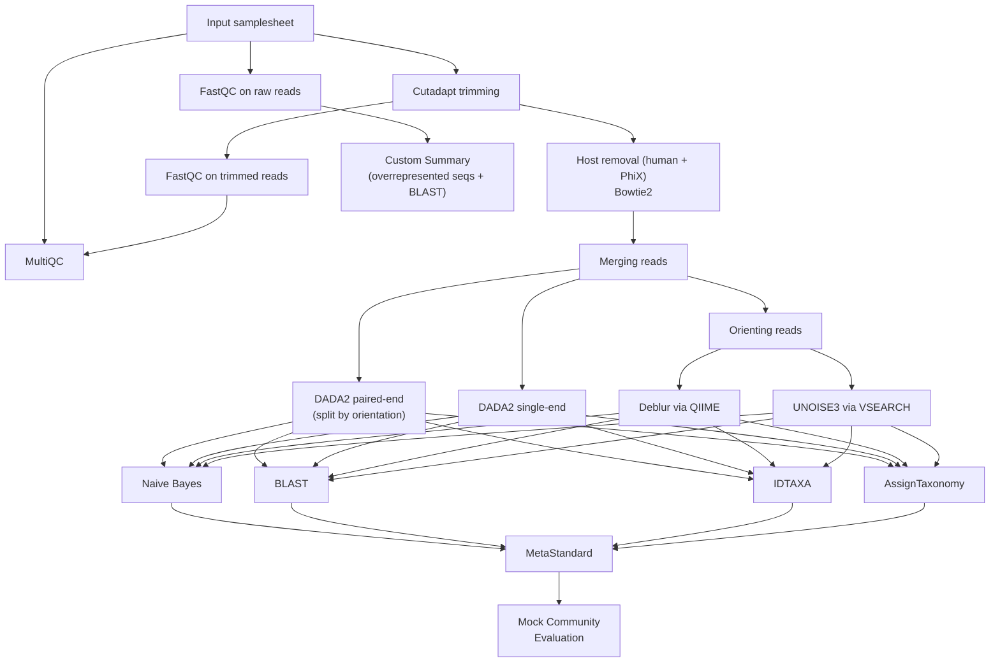

# 16S rRNA amplicon workflow

## Table of Contents
- 🧬 [Overview](#overview)
- 🚀 [Quick Usage](#quick-usage)
- 📦 [Requirements](#requirements)
- 🛠️ [Installation](#installation)
- ⚙️ [Configuration](#configuration)
- 🔬 [Pipeline description](#pipeline-description)
- 📥 [Inputs](#inputs)
- 📤 [Outputs](#outputs)
- 📚 [References](#references)

## 🧬 Overview

This Nextflow pipeline performs taxonomic profiling of paired-end 16S rRNA amplicon data (default for V3-V4 region). The pipeline integrates quality control, primer & adapter trimming, host removal, ASV inference and taxonomic assignment using multiple complementary tools.

All parameters are set to work properly on specific data from our lab. Before any usage, please check if it fits your data as well. 



## 🚀 Quick Usage

Prerequisites can be download using:

```
bash setup_pipeline.sh
```

Whole workflow can be executed by:

```
nextflow run main.nf --input <path/to/your/samplesheet.csv> --outdir <path/to/your/result_dir>
```

**Test the pipeline**

During installation of prerequisites, the test dataset was download in the `test` directory, you can therefore quickly test the pipeline functionality using:

```
nextflow run main.nf --input test/test_samplesheet.csv --outdir results --all

```

## 📦 Requirements

The pipeline uses Nextflow ≥22.10.0 and Singularity which is assumed to be pre-installed by the user. You will need at least 8 GB of RAM, 16 CPUs, 5 GB of storage for downloading the classifier and Singularity images, and additional storage for running the pipeline (this can vary depending on how many samples you have).


## 🛠️ Installation 

The easiest way to get Nextflow and Singularity is to set up a dedicated Conda environment:

```bash
conda create --prefix </path/to/your/new/nf-env/> bioconda::nextflow
conda activate </path/to/your/new/nf-env/>
conda install conda-forge::singularity
```

Then, clone the pipeline repository from GitHub and run the provided setup script. The script will interactively ask for an installation directory, where it will create three subdirectories: `classifiers/` for reference databases, `singularity_cache/`  for container images and `bowtie_phix` for hostile indixes:

```bash
git clone https://github.com/xpolak37/16S-rRNA-amplicon-workflow.git
cd 16S-rRNA-amplicon-workflow
bash setup_pipeline.sh
```

Finally, open `nextflow.config` in the pipeline directory and update `</path/to/your/installation/directory/>` in the following parameters:

```bash
params {
    singularity_cache_dir     = '</path/to/your/installation/directory>/singularity_cache'  // Container images cache
    classifiers_dir = '</path/to/your/installation/directory>/classifiers' // path to your classifiers
    bowtie_dir = '</path/to/your/installation/directory>/bowtie_phix'
}
```

**You are now ready to go!**

## ⚙️ Configuration

All pipeline parameters are defined in the **`nextflow.config`** file.

Before running the pipeline, you should review this file and adjust the parameters according to your system and  dataset. The configuration includes:

* input/output locations
* cache directories for containers and classifiers
* primer sequences
* DADA2, Deblur, and UNOISE3 filtering settings
* taxonomic classification parameters
* custom summary report and BLAST settings
* resource allocation (CPU, memory, runtime)

**How to modify parameters**

You can configure the pipeline in **two ways**:

1. Edit `nextflow.config` 

Open the configuration file and modify values inside the `params` block.

2. Override parameters from the command line

Any parameter can be changed at execution time using `--parameter_name`:

```bash
nextflow run main.nf \
    --input samplesheet.csv \
    --outdir results \
    --tax_level species
```

Command-line parameters always override values defined in `nextflow.config`.

**UNOISE3 parameters** (in `nextflow.config`):

```groovy
params {
    unoise_maxee        = 1.0   // Max expected errors for quality filtering
    unoise_minlen       = 100   // Min sequence length after filtering
    unoise_minsize      = 2     // Min abundance to retain a unique sequence
    unoise_alpha        = 2.0   // UNOISE alpha parameter
    unoise_id           = 0.97  // Identity threshold for mapping reads to ZOTUs
    unoise_fastq_qmax   = 93    // Max FASTQ quality score (high for NovaSeq/NextSeq)
}
```

**Custom summary parameters** (in `nextflow.config`):

```groovy
params {
    custom_summary                 = true            // Enable/disable custom per-run summary
    custom_summary_blast           = true            // BLAST overrepresented sequences (local 16S_ribosomal_RNA db)
    custom_summary_blast_timeout   = 120             // Per-sequence BLAST timeout (seconds)
    custom_summary_blast_max_seqs  = 50              // Max sequences to BLAST (most abundant first)
    custom_summary_blast_db        = '16S_ribosomal_RNA'  // BLAST database name
}
```

---

## 🔬 Pipeline Description

The 16S Profiling Pipeline is a modular Nextflow workflow designed for comprehensive analysis of 16S rRNA amplicon sequencing data. The pipeline integrates multiple widely-used bioinformatics tools for quality control, preprocessing, ASV inference, taxonomic assignment, and reporting, providing a reproducible and scalable solution for microbiome profiling.

### Workflow Overview

1. **Input and Quality Control**  
   Raw sequencing data are read from a samplesheet, and each pair of FASTQ files is first assessed with **FastQC** to evaluate sequence quality, adapter content, and other quality metrics.

2. **Adapter and Primer Trimming**  
   Sequencing primers and adapters are removed using **Cutadapt**, generating trimmed reads for downstream analysis. Trimmed reads are re-evaluated with FastQC to ensure quality after trimming.

3. **Host and Contaminant Removal**  
   Reads originating from the host genome or common contaminants such as PhiX are removed using direct **Bowtie2** alignment against pre-built host and PhiX indexes, reducing false-positive ASVs and improving classification accuracy.

4. **ASV Inference**  
   The pipeline supports multiple ASV inference strategies:
   - **DADA2 paired-end** — reads are first split by orientation so DADA2 learns separate error models per strand, then ASV tables are merged
   - **DADA2 single-end**
   - **Deblur via QIIME**
   - **UNOISE3 via VSEARCH** — de-novo chimera-free ZOTUs using the UNOISE3 algorithm

   Optional merging and orientation steps are applied where required (Deblur and UNOISE3 use SILVA-oriented reads; DADA2 paired-end uses orientation-split reads).

5. **Taxonomic Assignment**  
   Each ASV table can be classified using multiple classifiers:
   - **QIIME Naive Bayes**  
   - **QIIME BLAST**  
   - **IDTAXA**  
   - **AssignTaxonomy (DADA2)**  
   

Each ASV_tool + Taxonomic_classifier pair will be then unified to standardized format  the **MetaStandard16S** module.

6. **Custom Summary Report**  
   A per-run HTML summary is generated from raw FastQC output. It reports key quality metrics and optionally BLASTs overrepresented sequences against the local `16S_ribosomal_RNA` BLAST database to flag potential contaminants or off-target amplification. BLAST runs with a configurable per-sequence timeout and saves results continuously so partial output is preserved if the step times out or is disabled.

7. **Reporting and Aggregation**  
   Quality metrics from all steps (raw reads, trimmed reads, ASV inference, and taxonomic classification) are aggregated with **MultiQC**, producing a comprehensive HTML report summarizing read quality, ASV statistics, and classification results.

### Key Features
- **Modular design:** Each step is implemented as a separate Nextflow module, allowing flexibility in running only selected parts of the workflow.
- **Reproducible environments:** All tools are containerized with Singularity, ensuring consistent results across systems.
- **Parameter flexibility:** All key parameters, including primer sequences, truncation lengths, and classifier paths, can be set in `nextflow.config` or overridden at runtime.
- **Support for multiple ASV inference and taxonomic classification strategies**, enabling benchmarking and comparison of methods.
- **Mock community evaluation:** Automatic comparison of observed vs. expected composition for mock samples, with Bray-Curtis dissimilarity, Pearson correlation, and RMSE metrics.
- **Custom per-run summary:** Lightweight HTML report with overrepresented sequence BLAST hits to quickly flag contamination or primer issues before full analysis.

## 📥 Inputs

The pipeline requires a CSV samplesheet with the following columns:

| Column | Description |
|--------|-------------|
| `sample` | Unique sample identifier |
| `read1` | Absolute or relative path to R1 FASTQ file (can be gzipped) |
| `read2` | Absolute or relative path to R2 FASTQ file (can be gzipped) |

**Example samplesheet (`samplesheet.csv`):**
```csv
sample,read1,read2
sample1,/path/to/sample1_R1.fastq.gz,/path/to/sample1_R2.fastq.gz
sample2,/path/to/sample2_R1.fastq.gz,/path/to/sample2_R2.fastq.gz
sample3,/path/to/sample3_R1.fastq.gz,/path/to/sample3_R2.fastq.gz
```


### 📤 Outputs

The pipeline generates the following output directory structure:

```
results
├── fastqc_raw
│   ├── SRR13005968-test_1_fastqc.html
│   ├── SRR13005968-test_1_fastqc.zip
│   ├── ...
├── fastqc_trimmed
│   ├── SRR13005968-test_R1.trimmed_fastqc.html
│   ├── SRR13005968-test_R1.trimmed_fastqc.zip
│   ├── ...
├── cutadapt
│   ├── SRR13005968-test_R1.trimmed.fastq.gz
│   ├── SRR13005968-test_R2.trimmed.fastq.gz
│   ├── ...
├── bbmap
│   ├── SRR13005968-test-mergedpairs.fastq.gz
│   ├── SRR13005969-test-mergedpairs.fastq.gz
│   ├── ..
├── dada2_PE
│   ├── ASV_sequences.fasta
│   ├── asv_table.tsv
│   └── track_control.tsv
├── dada2_SE
│   ├── ASV_sequences.fasta
│   ├── asv_table.tsv
│   └── track_control.tsv
├── deblur
│   ├── asv_table.tsv
│   ├── dna-sequences.fasta
│   └── stats.csv
├── unoise
│   ├── ASV_sequences.fasta
│   ├── asv_table.tsv
│   └── track_control.tsv
├── custom_summary
│   ├── custom_summary.html
│   └── raw_custom_summary.txt
├── qnb
│   ├── dada2_taxa_table.tsv
│   └── deblur_taxa_table.tsv
├── qblast
│   ├── dada2_taxa_table.tsv
│   └── deblur_taxa_table.tsv
├── assigntaxonomy
│   ├── dada2_taxa_table.tsv
│   └── deblur_taxa_table.tsv
├── idtaxa
│   ├── dada2_taxa_table.tsv
│   └── deblur_taxa_table.tsv
├── metastandard
│   ├── dada2_AssignTaxonomy_runID_genus.tsv
│   ├── dada2_BLAST_runID_genus.tsv
│   ├── deblur_AssignTaxonomy_runID_genus.tsv
│   ├── deblur_BLAST_runID_genus.tsv
│   └── ...
├── multiqc
│   ├── multiqc_citations.txt
│   ├── multiqc_data.json
│   ├── multiqc_fastqc.txt
│   ├── multiqc_general_stats.txt
│   └── ...
└── pipeline_info
    ├── dag.svg
    ├── report.html
    ├── timeline.html
    └── trace.txt
```

**Output Descriptions**

| Directory | Contents | Description |
|-----------|----------|-------------|
| `fastqc_raw/` | FastQC HTML & ZIP reports | Quality metrics for raw reads |
| `fastqc_trimmed/` | FastQC HTML & ZIP reports | Quality metrics for trimmed reads (after Cutadapt) |
| `cutadapt/` | Trimmed FASTQ files | Reads after adapter and primer removal |
| `hostile/` | Decontaminated FASTQ files | Reads after human and PhiX decontamination (Bowtie2) |
| `dada2/` | ASV tables & FASTA sequences | DADA2 ASV inference outputs |
| `bbmap/` | Merged FASTQ reads | Paired-end reads merged for Deblur/UNOISE |
| `usearch_oriented/` | Oriented & merged FASTQ reads | Orientation-corrected reads for Deblur/UNOISE |
| `deblur/` | ASV tables & FASTA sequences | Deblur ASV inference outputs |
| `unoise/` | ZOTU tables & FASTA sequences | UNOISE3 (VSEARCH) de-novo ZOTU inference outputs |
| `custom_summary/` | HTML report & plain-text summary | Per-run quality summary with optional BLAST of overrepresented sequences |
| `qnb/` | Taxa tables (DADA2 & Deblur) | Taxonomic assignment using QIIME naive-bayes classifier |
| `qblast/` | Taxa tables (DADA2 & Deblur) | Taxonomic assignment using QIIME BLAST classifier |
| `assigntaxonomy/` | Taxa tables (DADA2 & Deblur) | Taxonomic assignment using DADA2 assignTaxonomy |
| `idtaxa/` | Taxa tables (DADA2 & Deblur) | Taxonomic assignment using DECIPHER IdTaxa |
| `metastandard/` | Standardized output tables| Standardized outputs of all branches of workflows  (DADA2 & Deblur & QNB & QBLAST & assignTaxonomy & IdTaxa)  |
| `mock_evaluation/` | Barplots, metrics, composition tables | Mock community evaluation comparing observed vs reference composition |
| `multiqc/` | MultiQC reports & JSON/logs | Aggregated QC metrics from all tools and samples |
| `pipeline_info/` | HTML, DAG, trace, timeline | Pipeline execution reports and workflow DAG |

---

## 🧪 Mock Community Evaluation

The pipeline includes automatic evaluation of mock community samples against a known reference composition. This feature helps assess the accuracy of the taxonomic classification.

### How it works

1. **Identifies mock samples** using regex pattern (default: `Mock\d+`)
2. **Extracts genus-level abundances** from MetaStandard output
3. **Compares with reference composition** at genus level
4. **Generates outputs:**
   - Stacked barplot comparing reference vs observed
   - Deviation metrics (Bray-Curtis dissimilarity, Pearson correlation, RMSE)
   - Full composition table

### Configuration

Mock evaluation is enabled by default. Configure in `nextflow.config`:

```groovy
params {
    mock_evaluation = true                          // Enable/disable
    mock_pattern = 'Mock\\d+'                       // Regex to identify mock samples
    mock_abundance = './composition/mock_asv_abundance.csv'  // Reference abundances
    mock_taxa = './composition/mock_taxa.csv'       // Reference taxonomy
    mock_top_n = 15                                  // Top genera to display
}
```

### Reference Files

Place your mock community reference files in the `composition/` directory:

**mock_asv_abundance.csv** - Expected abundances per ASV:
```csv
ASV,Mock Reference
ASV1,0.042
ASV2,0.101
...
```

**mock_taxa.csv** - Taxonomy for each ASV:
```csv
ASV,Domain,Phylum,Class,Order,Family,Genus,Species
ASV1,Bacteria,Proteobacteria,Gammaproteobacteria,Pseudomonadales,Pseudomonadaceae,Pseudomonas,Pseudomonas aeruginosa
...
```

### Output Files

For each ASV tool + classifier combination:
- `<workflow>_mock_barplot.png` - Visual comparison
- `<workflow>_mock_metrics.tsv` - Quantitative metrics
- `<workflow>_mock_composition.tsv` - Full data table

---


## 📚 References

If you use this pipeline, please cite:

- **Nextflow:** Di Tommaso, P., et al. (2017). Nextflow enables reproducible computational workflows. Nature Biotechnology, 35(4), 316-319.
- **FastQC:** Andrews, S. (2010). FastQC: A Quality Control Tool for High Throughput Sequence Data.
- **MultiQC:** Ewels, P., et al. (2016). MultiQC: summarize analysis results for multiple tools and samples in a single report. Bioinformatics, 32(19), 3047-3048.
- **DADA2:** Callahan,  et al. (2016).  DADA2: High-resolution sample inference from Illumina amplicon data. Nat Methods 13, 581–583.
- **DEBLUR:** Amir, A., et al. (2017). Deblur Rapidly Resolves Single-Nucleotide Community Sequence Patterns. mSystems, 2(2), e00191-16. 
- **QIIME2:** Bolyen E, et al.(2019). Reproducible, interactive, scalable and extensible microbiome data science using QIIME 2. Nature Biotechnology 37: 852–857. 
- **DECIPHER:** ES Wright (2024). Fast and Flexible Search for Homologous Biological Sequences with DECIPHER v3."The R Journal, 16(2), 191-200.
- **VSEARCH:** Rognes, T., et al. (2016). VSEARCH: a versatile open source tool for metagenomics. PeerJ, 4, e2584.
